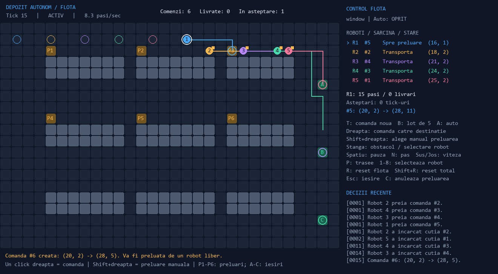
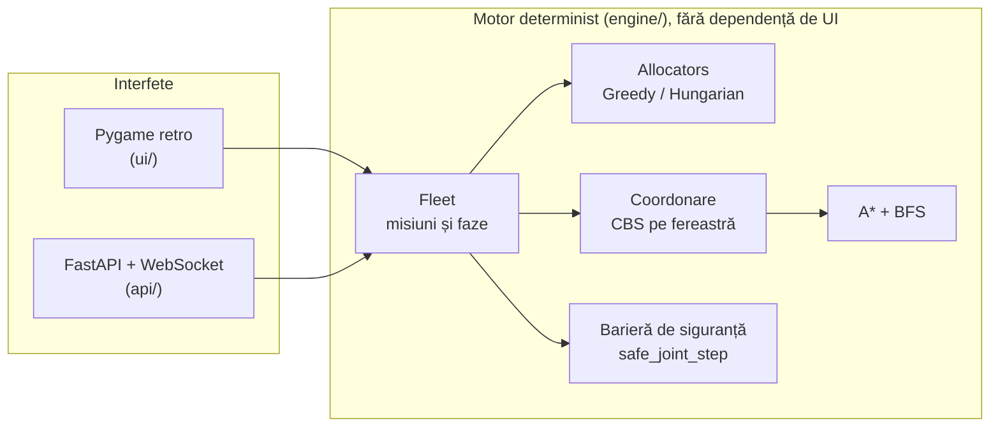

# 🏭 Micul Depozit — Digital Twin pentru logistică autonomă

> Simulator de flotă de roboți de depozit (3–8 roboți) cu planificare multi-agent fără coliziuni,
> alocare optimă a comenzilor, API în timp real și — în lucru — control prin limbaj natural,
> învățare prin întărire și dashboard web.
>
> Proiect personal, construit pas cu pas ca să învăț algoritmică, arhitectură software și AI aplicat.



## Stare curentă

Proiectul crește pe faze. Tabelul de mai jos spune sincer ce există deja și ce urmează.

| Componentă | Stare |
| --- | --- |
| Motor determinist de flotă (A*, alocare, faze de misiune) | ✅ Gata |
| Coordonare MAPF: CBS pe fereastră spațio-temporală + barieră de siguranță | ✅ Gata |
| Interfață retro Pygame (pixel art desenat în cod) | ✅ Gata |
| Restructurare în pachete (`engine/`, `ui/`, `api/`, `benchmark/`, `tests/`) | ✅ Gata |
| API REST + WebSocket (FastAPI) | ✅ Gata (v1) |
| Alocare optimă cu algoritmul Hungarian vs. Greedy | ✅ Gata |
| Grafice comparative de benchmark (`benchmark/plots.py`) | 🚧 În lucru |
| Control în limbaj natural (Gemini, function calling) | 🗺️ Planificat |
| Layout din imagine (Gemini Vision) | 🗺️ Planificat |
| Dashboard web React + TypeScript | 🗺️ Planificat |
| Multi-Agent Reinforcement Learning (IQL) vs. CBS | 🗺️ Planificat |
| Predicții și detectare de anomalii | 🗺️ Planificat |
| Docker + CI (GitHub Actions) | 🗺️ Planificat |

**92 de teste automate trec** (`pytest`).

## Pornire rapidă

Necesită Python 3.11+. Pe Python 3.14 se folosește `pygame-ce` (fork activ al `pygame`),
pentru că `pygame` clasic nu are încă pachete compilate pentru această versiune.

```bash
git clone https://github.com/m0t0gna/Depozit-Autonom.git
cd Depozit-Autonom
python3 -m venv .venv
source .venv/bin/activate          # Windows: .\.venv\Scripts\Activate.ps1
pip install -r requirements-dev.txt
```

Interfața retro (fereastră Pygame):

```bash
python main.py                              # flotă de 5 roboți
python main.py --robots 8 --seed 42
python main.py --coordination conservative  # comparator mai simplu
python main.py --single                     # demo-ul original, un singur robot
```

Serverul API (după pornire, documentația interactivă e la <http://127.0.0.1:8000/docs>):

```bash
uvicorn api.server:app --reload
```

Teste și benchmark:

```bash
SDL_VIDEODRIVER=dummy python -m pytest -q     # Windows: setează variabila separat
PYTHONPATH=. python benchmark/comparator.py   # Greedy vs. Hungarian
```

## Cum funcționează



**Ideea centrală:** motorul (`engine/`) nu știe nimic despre Pygame sau web. Pentru că e
determinist și rulează pe „tick-uri" discrete, același cod servește interfața grafică, serverul,
benchmark-urile și (în viitor) antrenarea de modele de învățare.

### Algoritmi implementați

- **A\*** pe grilă cu euristică Manhattan, pentru drumuri individuale.
- **Câmp de distanțe BFS** invers de la țintă, folosit ca euristică exactă pentru căutarea în timp.
- **A\* spațio-temporal** pe stări `(celulă, timp)`, cu acțiune de așteptare și restricții de nod/muchie.
- **Conflict-Based Search (CBS)** pe fereastră de 12 tick-uri și buget de 80 de noduri, cu
  revenire la un coordonator conservator dacă bugetul nu dă soluție.
- **Barieră de siguranță** independentă de algoritmul ales: niciun pas comun nu se aplică dacă are
  coliziuni de celulă, schimburi frontale sau salturi mai mari de o celulă.
- **Alocare Greedy** (FIFO, cel mai apropiat robot) și **Hungarian** (cost total minim, via
  `scipy.optimize.linear_sum_assignment`).

## Rezultate de benchmark

Test de stres: 20 de comenzi apar simultan, 5 roboți, coordonare `window`, seed fix.

| Alocator | Livrate | Pași totali | Ticks de așteptare | Timp CPU |
| --- | --- | --- | --- | --- |
| Greedy | 20/20 | 966 | 4 | 0,27 s |
| Hungarian | 20/20 | 906 | 12 | 0,36 s |

Hungarian a redus drumul total parcurs cu ~6%, dar a avut mai multe așteptări în trafic.
**Este un singur scenariu cu un singur seed**, deci arată o tendință, nu o concluzie generală.
Cu comenzi care apar încet (una la 20 de tick-uri) cei doi alocatori dau rezultate identice,
fiindcă aproape niciodată nu sunt mai multe comenzi decât roboți liberi. Rularea pe mai multe
seed-uri și graficele sunt următorul pas.

Benchmark-ul vechi dintre coordonatorul `window` și cel `conservative` (8 roboți, 20 comenzi,
seed-uri 7/19/42) e în [`artifacts/benchmark.json`](artifacts/benchmark.json): ambii au livrat 20/20 fără
conflicte, iar `window` a avut mult mai puține așteptări (1/0/1 față de 21/7/17).

## API

| Endpoint | Metodă | Ce face |
| --- | --- | --- |
| `/api/fleet` | GET | Starea completă: roboți, comenzi, hartă |
| `/api/fleet/step` | POST | Avansează simularea cu un tick |
| `/api/fleet/task` | POST | Adaugă o comandă (`pickup`, `dropoff`) |
| `/api/fleet/task/random` | POST | Adaugă o comandă aleatoare |
| `/api/fleet/edit` | POST | Adaugă/scoate un perete la o celulă |
| `/api/fleet/reset` | POST | Reia simularea (`robot_count`, `coordination`) |
| `/ws/live` | WebSocket | Flux de stări; trimite textul `play`, `pause` sau `step` |

CORS este deschis (`*`) pentru dezvoltare locală; trebuie restrâns înainte de orice publicare.

## Controale în interfața retro

| Comandă | Acțiune |
| --- | --- |
| `W` / `T` | Alege unealta: pereți / cutii |
| Click stânga | Folosește unealta pe celula aleasă |
| Click dreapta | Cutie cu livrare automată |
| Click pe robot sau `1`–`8` | Arată traseul robotului |
| `Spațiu`, `N`, `↑`/`↓` | Pauză, un pas, viteză |
| `R` / `Shift+R` | Reset roboți / reset complet |
| `H` | Ajutor |

Lista completă, plus deciziile de design, sunt în [`docs/CHECKPOINTS.md`](docs/CHECKPOINTS.md)
și [`docs/DESIGN.md`](docs/DESIGN.md).

## Structura proiectului

```
engine/     motorul: grid, A*, flotă, coordonare, alocatori
ui/         interfața Pygame retro, sprite-uri pixel art, efecte
api/        server FastAPI: scheme Pydantic, REST, WebSocket
benchmark/  rulări headless și comparatoare
ai/         (în lucru) Gemini NL/Vision și învățare prin întărire
tests/      92 de teste
scripts/    generarea capturilor din artifacts/
docs/       istoric, design, decizii
main.py     punct de intrare CLI
```

## Limitări cunoscute

- **Nu există garanție generală de absență a deadlock-urilor.** Culoarele înguste fără refugiu,
  țintele ocupate permanent și limitele căutării pot opri progresul.
- Planificarea acoperă o fereastră de 12 tick-uri; dincolo de ea traseul afișat e orientativ.
- Roboții inactivi nu se mută singuri ca să elibereze o țintă. Bazele nu simulează baterii.
- Starea API-ului e globală, într-un singur proces: nu e gândită pentru mai mulți utilizatori simultan.
- Alocatorul nu poate fi ales încă prin API; momentan se alege din cod (`Fleet(allocator=...)`).

## Securitate

Cheile API (Gemini) se țin în fișierul `.env`, care e în `.gitignore` și nu ajunge niciodată pe
GitHub. Modelul pentru el este `.env.example`.

## Foaie de parcurs

1. Grafice și rulări pe mai multe seed-uri pentru benchmark (`benchmark/plots.py`).
2. Control în limbaj natural cu Gemini function calling.
3. Layout de depozit generat dintr-o imagine (Gemini Vision).
4. Dashboard React + TypeScript peste API-ul existent.
5. Învățare prin întărire multi-agent (Independent Q-Learning), comparată cu CBS.
6. Analiză predictivă, Docker și CI.
