# 🏭 Plan Definitiv de Implementare — Micul Depozit → Digital Twin AI

## Decizii finale

| Întrebare | Decizie |
|---|---|
| Features | Toate cele 10 **minus** Voice Control |
| API Key | Ai Google AI Plus → îți arăt cum iei key-ul gratuit din AI Studio |
| Deadline | Fără — facem bine, învățăm din fiecare pas |
| Prezentare live | Nu — dar README-ul cu GIF-uri va fi "prezentarea" |
| Pygame | **Păstrăm** ca mod retro/demo (`--pygame`). Dashboard web devine modul principal |
| Frontend | **React + TypeScript** (explicație mai jos) |

### De ce React + TypeScript?

- **React** e cel mai cerut framework pe piața din Cluj și global (~40% din job-urile frontend). Vue e bun, dar React domină.
- **TypeScript** adaugă tipuri statice peste JavaScript — prinde erori la compilare, nu la runtime. La un proiect serios e obligatoriu.
- **Alternativa simplă** ar fi fost vanilla JS + HTML Canvas, dar pentru CV-ul tău React + TS e mult mai valoros.
- Pe parcurs îți explic fiecare concept React/TS — nu trebuie să le știi dinainte.

### Cum obții API Key Gemini

Ai Google AI Plus, deci ai acces la Gemini API gratuit:

1. Deschide **[aistudio.google.com](https://aistudio.google.com)**
2. Autentifică-te cu contul Google (cel cu AI Plus)
3. Click pe **"Get API key"** (colțul din stânga sus sau din meniul lateral)
4. Click pe **"Create API key"** → selectează un proiect Google Cloud (sau creează unul nou)
5. Copiază key-ul generat — arată ca `AIzaSy...` (~39 caractere)
6. **NU-L PUNE ÎN COD!** Îl vom salva într-un fișier `.env` care e în `.gitignore`

> [!CAUTION]
> API key-ul nu se pune NICIODATĂ în codul sursă sau pe GitHub. Vom folosi python-dotenv pentru a-l citi din `.env`.

---

## Structura pe faze

```mermaid
gantt
    title Faze de implementare
    dateFormat  X
    axisFormat %s
    
    section Faza 1
    Restructurare & Digital Twin    :f1, 0, 2
    
    section Faza 2
    FastAPI Backend + WebSocket     :f2, 2, 4
    
    section Faza 3
    Hungarian + Benchmark Avansat   :f3, 4, 2
    
    section Faza 4
    Gemini NL + Computer Vision     :f4, 6, 3
    
    section Faza 5
    React Dashboard                 :f5, 9, 4
    
    section Faza 6
    MARL (Reinforcement Learning)   :f6, 13, 5
    
    section Faza 7
    Analytics + DevOps + Docs       :f7, 18, 3
```



---

## Faza 1 — Restructurare & Digital Twin Architecture

**Scopul:** Transformăm proiectul dintr-un folder plat cu 15 fișiere Python într-un proiect structurat profesional, cu pachete, configurare modernă și separare clară a responsabilităților.

**Ce înveți:** Structurare de proiect Python, `pyproject.toml`, pachete și module, pattern-uri de organizare a codului.

### Structura nouă de foldere

```
Depozit-Autonom/
├── pyproject.toml              # [NEW] Configurare proiect modernă (înlocuiește setup.py)
├── .env.example                # [NEW] Template pentru variabile de mediu
├── .gitignore                  # [MODIFY] Actualizat pentru .env, __pycache__, node_modules
├── README.md                   # [MODIFY] Rescris complet (Faza 7)
├── DESIGN.md                   # Păstrat
│
├── engine/                     # [NEW] Pachet — motorul de simulare (zero dependințe UI)
│   ├── __init__.py
│   ├── grid.py                 # ← din grid.py
│   ├── astar.py                # ← din astar.py
│   ├── robot.py                # ← din robot.py
│   ├── fleet.py                # ← din fleet.py
│   ├── coordination.py         # ← din coordination.py
│   ├── commands.py             # ← din commands.py
│   └── allocators.py           # [NEW] Greedy + Hungarian (Faza 3)
│
├── ai/                         # [NEW] Pachet — toate componentele AI
│   ├── __init__.py
│   ├── gemini_nl.py            # [NEW] Interfață limbaj natural (Faza 4)
│   ├── gemini_vision.py        # [NEW] Layout scanner CV (Faza 4)
│   ├── analytics.py            # [NEW] Predictive analytics (Faza 7)
│   └── rl/                     # [NEW] Sub-pachet RL (Faza 6)
│       ├── __init__.py
│       ├── environment.py      # [NEW] Gymnasium wrapper pentru Fleet
│       ├── iql_agent.py        # [NEW] Independent Q-Learning
│       ├── train.py            # [NEW] Script de antrenare
│       └── evaluate.py         # [NEW] Comparație RL vs CBS vs Conservative
│
├── api/                        # [NEW] Pachet — FastAPI server (Faza 2)
│   ├── __init__.py
│   ├── server.py               # [NEW] FastAPI app, endpointuri REST
│   ├── websocket.py            # [NEW] WebSocket real-time stream
│   ├── schemas.py              # [NEW] Pydantic models pentru request/response
│   └── dependencies.py         # [NEW] Dependency injection, state management
│
├── web/                        # [NEW] React frontend (Faza 5)
│   ├── package.json
│   ├── tsconfig.json
│   ├── src/
│   │   ├── App.tsx
│   │   ├── components/
│   │   │   ├── DepotCanvas.tsx # [NEW] Canvas 2D rendering
│   │   │   ├── Dashboard.tsx   # [NEW] Grafice și metrici
│   │   │   ├── ChatPanel.tsx   # [NEW] Chat AI cu Gemini
│   │   │   ├── HeatMap.tsx     # [NEW] Heatmap trafic
│   │   │   └── Controls.tsx    # [NEW] Butoane și slider-e
│   │   ├── hooks/
│   │   │   └── useWebSocket.ts # [NEW] Hook pentru WebSocket
│   │   └── types/
│   │       └── depot.ts        # [NEW] TypeScript types
│   └── public/
│
├── ui/                         # [RENAME] Interfața Pygame (legacy/retro)
│   ├── __init__.py
│   ├── fleet_ui.py             # ← din fleet_ui.py
│   ├── retro_view.py           # ← din retro_view.py
│   ├── pixel_art.py            # ← din pixel_art.py
│   ├── atelier_decor.py        # ← din atelier_decor.py
│   ├── route_view.py           # ← din route_view.py
│   └── turn_effects.py         # ← din turn_effects.py
│
├── benchmark/                  # [NEW] Pachet benchmark extins
│   ├── __init__.py
│   ├── runner.py               # ← din benchmark.py
│   ├── comparator.py           # [NEW] Greedy vs Hungarian vs RL (Faza 3+6)
│   └── plots.py                # [NEW] Generare grafice matplotlib/Plotly
│
├── tests/                      # [MOVE] Toate testele grupate
│   ├── test_astar.py
│   ├── test_commands.py
│   ├── test_coordination.py
│   ├── test_fleet.py
│   ├── test_benchmark.py
│   ├── test_simulation.py
│   ├── test_retro_ui.py
│   ├── test_route_view.py
│   ├── test_turn_effects.py
│   ├── test_api.py             # [NEW] Teste API (Faza 2)
│   ├── test_allocators.py      # [NEW] Teste Hungarian (Faza 3)
│   ├── test_gemini.py          # [NEW] Teste NL + CV (Faza 4)
│   └── test_rl.py              # [NEW] Teste RL (Faza 6)
│
├── scripts/                    # [NEW] Scripturi utilitare
│   ├── render_preview.py       # ← din render_preview.py
│   └── generate_docs.py        # [NEW] Generare documentație
│
├── artifacts/                  # Păstrat — benchmark results, screenshots
├── docs/                       # [NEW] Documentație academică
│   ├── architecture.md
│   ├── algorithms.md
│   └── adr/                    # Architecture Decision Records
│
├── Dockerfile                  # [NEW] (Faza 7)
├── docker-compose.yml          # [NEW] (Faza 7)
└── .github/
    └── workflows/
        └── ci.yml              # [NEW] GitHub Actions (Faza 7)
```

### Ce facem concret

#### [MODIFY] Toate fișierele engine — actualizare importuri
Mutăm fișierele în pachete și actualizăm importurile. De exemplu, în `engine/fleet.py`:
```python
# Înainte (import direct dintr-un folder plat):
from astar import astar
from coordination import WindowCoordinator

# După (import din pachet):
from engine.astar import astar
from engine.coordination import WindowCoordinator
```

#### [NEW] `pyproject.toml`
Înlocuiește `requirements.txt` cu configurare modernă:
```toml
[project]
name = "depozit-autonom"
version = "2.0.0"
description = "Digital Twin platform for autonomous warehouse logistics with AI"
requires-python = ">=3.11"
dependencies = [
    "fastapi>=0.115",
    "uvicorn[standard]>=0.30",
    "websockets>=13",
    "pydantic>=2.9",
    "python-dotenv>=1.0",
]

[project.optional-dependencies]
pygame = ["pygame>=2.6"]
ai = ["google-genai>=1.0", "Pillow>=10"]
rl = ["torch>=2.4", "gymnasium>=1.0"]
analytics = ["scikit-learn>=1.5", "pandas>=2.2", "matplotlib>=3.9"]
dev = ["pytest>=9.1", "httpx>=0.27", "ruff>=0.6"]
all = ["depozit-autonom[pygame,ai,rl,analytics,dev]"]
```

#### [NEW] `.env.example`
```
GEMINI_API_KEY=your-key-here
```

#### [MODIFY] `.gitignore`
Adăugăm: `.env`, `__pycache__/`, `node_modules/`, `web/dist/`, `*.egg-info/`, `.venv/`

---

## Faza 2 — FastAPI Backend + WebSocket

**Scopul:** Expunem motorul `Fleet` ca API server, permițând oricărui client (web, mobile, alt program) să controleze simularea.

**Ce înveți:** REST API design, WebSocket, async Python, Pydantic validation, dependency injection.

### Fișiere noi

#### [NEW] `api/schemas.py` — Modelele de date
```python
from pydantic import BaseModel

class RobotState(BaseModel):
    id: int
    pos: tuple[int, int]
    home: tuple[int, int]
    phase: str          # idle, to_pickup, delivering, parking
    task_id: int | None
    goal: tuple[int, int] | None
    steps: int
    wait_ticks: int
    deliveries: int
    carrying: bool

class TaskState(BaseModel):
    id: int
    pickup: tuple[int, int]
    dropoff: tuple[int, int]
    status: str         # pending, assigned, carrying, completed
    robot_id: int | None

class FleetState(BaseModel):
    tick: int
    robots: list[RobotState]
    tasks: list[TaskState]
    grid_width: int
    grid_height: int
    blocked: list[tuple[int, int]]
    dropoffs: list[tuple[int, int]]
    completed: int
    pending: int
```

#### [NEW] `api/server.py` — Endpointuri REST + WebSocket

| Endpoint | Metodă | Ce face |
|---|---|---|
| `/api/fleet` | GET | Starea completă a flotei |
| `/api/fleet/step` | POST | Avansează N tick-uri |
| `/api/fleet/task` | POST | Adaugă o comandă (pickup, dropoff) |
| `/api/fleet/edit` | POST | Toggle perete la celula (x, y) |
| `/api/fleet/reset` | POST | Resetează simularea |
| `/api/fleet/config` | GET/PUT | Parametri (robots, seed, coordination) |
| `/api/fleet/metrics` | GET | Statistici agregate |
| `/api/fleet/heatmap` | GET | Matrice de frecvență per celulă |
| `/ws/live` | WebSocket | Stream de stări la fiecare tick |

---

## Faza 3 — Hungarian Algorithm + Benchmark Avansat

**Scopul:** Adăugăm alocare optimală de task-uri și un framework de comparație riguroasă.

**Ce înveți:** Optimizare combinatorială, algoritmul Hungarian (Munkres), evaluare experimentală, matplotlib/Plotly.

### Fișiere noi

#### [NEW] `engine/allocators.py`
Trei strategii de alocare, toate cu aceeași interfață:

```python
class GreedyAllocator:     # Cel existent — FIFO + cel mai apropiat robot
class HungarianAllocator:  # Munkres pe matrice de cost A*
class RLAllocator:         # Placeholder pentru Faza 6
```

#### [NEW] `benchmark/comparator.py`
Rulează aceleași scenarii (seed-uri fixe) cu fiecare combinație allocator × coordinator și exportă CSV + JSON.

#### [NEW] `benchmark/plots.py`
Generează grafice comparative: throughput, latență medie/p95, utilizare roboți, tick-uri de așteptare.

---

## Faza 4 — Gemini NL + Computer Vision

**Scopul:** Integrăm AI generativ pentru control în limbaj natural și scanarea de layout-uri din imagini.

**Ce înveți:** Gemini API, function calling, multimodal AI, prompt engineering, structured output.

### Fișiere noi

#### [NEW] `ai/gemini_nl.py` — Interfață limbaj natural
- Definește schema de funcții (tools) pentru Gemini: `add_task`, `edit_wall`, `query_stats`, `suggest_layout`
- Menține conversația (chat history) pentru context
- Parsează răspunsul Gemini și execută acțiunile pe `Fleet`

#### [NEW] `ai/gemini_vision.py` — Layout scanner
- Primește o imagine (poză sau schiță)
- Trimite la Gemini Vision cu prompt structurat
- Extrage JSON: `{width, height, blocked: [[x,y], ...], exits: [...], bases: [...]}`
- Convertește la `Grid` + configurare `Fleet`

---

## Faza 5 — React Dashboard

**Scopul:** Interfață web modernă care comunică cu backend-ul prin REST + WebSocket.

**Ce înveți:** React, TypeScript, Canvas 2D, WebSocket hooks, Chart.js, responsive design, state management.

### Componente principale

| Componentă | Ce face |
|---|---|
| `DepotCanvas.tsx` | Renderează grila, roboții, traseele pe HTML Canvas (stil pixel art) |
| `Dashboard.tsx` | Grafice live: throughput/minut, latență, utilizare |
| `ChatPanel.tsx` | Chat cu Gemini — trimite mesaje text, primește răspunsuri + acțiuni |
| `HeatMap.tsx` | Heatmap de trafic colorat pe grilă |
| `Controls.tsx` | Butoane: play/pause, viteză, reset, upload imagine (CV) |
| `useWebSocket.ts` | Hook React care menține conexiunea WS și actualizează starea |

---

## Faza 6 — Multi-Agent Reinforcement Learning

**Scopul:** Roboții învață strategii de coordonare prin experiență. Comparăm cu CBS.

**Ce înveți:** Reinforcement Learning, Gymnasium, PyTorch, Independent Q-Learning, MARL, experiment design.

### Fișiere noi

#### [NEW] `ai/rl/environment.py` — Gymnasium wrapper
Transformă `Fleet` într-un environment standard Gymnasium:
- **Observation space:** Grid-ul ca matrice + pozițiile roboților + task-uri
- **Action space:** Discrete(5) per robot — sus/jos/stânga/dreapta/wait
- **Reward:** +10 livrare, −5 coliziune, −0.1 așteptare, +0.01 pas valid

#### [NEW] `ai/rl/iql_agent.py` — Independent Q-Learning
- Fiecare robot are propriul Q-network (MLP simplu: 3 layere, ReLU)
- Experience replay buffer partajat
- Epsilon-greedy exploration → decay la 0.05

#### [NEW] `ai/rl/train.py` — Script de antrenare
- Antrenare headless pe Fleet (fără Pygame, fără server — direct pe motor)
- Logging cu metrici: reward mediu, livrări/episod, coliziuni
- Salvare checkpoints periodice

#### [NEW] `ai/rl/evaluate.py` — Comparație
- Rulează aceleași scenarii benchmark cu: CBS, Conservative, IQL
- Generează tabel comparativ + grafice

---

## Faza 7 — Analytics + DevOps + Documentație

**Scopul:** Adăugăm predicție ML, containerizare și documentație spectaculoasă.

**Ce înveți:** Scikit-learn, time series, Docker, GitHub Actions, technical writing.

### Analytics
- `ai/analytics.py`: Random Forest pentru predicție throughput, Isolation Forest pentru anomalii
- Gemini generează rapoarte în limbaj natural din datele de benchmark

### DevOps
- `Dockerfile` multi-stage (Python backend + Node frontend)
- `docker-compose.yml` (backend + frontend + opțional Grafana)
- `.github/workflows/ci.yml` (pytest + lint + Docker build la push)
- Badge-uri în README

### README Spectaculos
- Hero banner / GIF animat cu simularea
- Diagrame Mermaid de arhitectură
- Tabele comparative (RL vs CBS)
- Secțiune "How it works" cu screenshots
- Secțiune "AI Features" cu demo GIF-uri
- Installation guide clar
- Contributing guide

---

## Ordine de execuție detaliată

> [!IMPORTANT]
> Fiecare fază se termină cu **teste verzi** și **funcționalitate completă**. Nu trecem la faza următoare până nu merge totul.

| Pas | Ce facem | Verificare |
|:---:|---|---|
| 1.1 | Creăm structura de foldere și mutăm fișierele | Toate cele 87 teste trec |
| 1.2 | `pyproject.toml` + `.env.example` + `.gitignore` | `pip install -e .` funcționează |
| 2.1 | `api/schemas.py` + `api/server.py` (REST) | `pytest test_api.py` + curl manual |
| 2.2 | `api/websocket.py` (WebSocket stream) | Script Python client test |
| 3.1 | `engine/allocators.py` (Hungarian) | `pytest test_allocators.py` |
| 3.2 | `benchmark/comparator.py` + `plots.py` | CSV + PNG grafice generate |
| 4.1 | `ai/gemini_nl.py` (function calling) | Test interactiv: "pune o cutie" → acțiune |
| 4.2 | `ai/gemini_vision.py` (layout scanner) | Imagine → Grid valid |
| 5.1 | React scaffold + `DepotCanvas.tsx` | Grid renderizat în browser |
| 5.2 | WebSocket hook + live rendering | Roboți mișcându-se în browser |
| 5.3 | `Dashboard.tsx` + `ChatPanel.tsx` + `HeatMap.tsx` | Dashboard complet funcțional |
| 6.1 | `ai/rl/environment.py` (Gymnasium wrapper) | `env.reset()` + `env.step()` funcționează |
| 6.2 | `ai/rl/iql_agent.py` + `train.py` | Antrenare 1000 episoade, reward crește |
| 6.3 | `ai/rl/evaluate.py` | Tabel comparativ RL vs CBS |
| 7.1 | `ai/analytics.py` | Predicții + anomalii detectate |
| 7.2 | Docker + CI/CD | `docker-compose up` pornește totul |
| 7.3 | README + docs | README spectaculos pe GitHub |

---

## Verification Plan

### Automated Tests
```bash
# La fiecare fază:
python -m pytest tests/ -q

# API specific:
python -m pytest tests/test_api.py -v

# Benchmark complet:
python -m benchmark.runner --robots 8 --seeds 7 19 42
```

### Manual Verification
- **Faza 2:** `curl http://localhost:8000/api/fleet` returnează JSON valid
- **Faza 4:** Chat cu Gemini execută comenzi pe depozit
- **Faza 5:** Dashboard-ul web arată roboții mișcându-se live
- **Faza 6:** Grafic de antrenare RL arată convergență
- **Faza 7:** `docker-compose up` pornește totul dintr-o comandă

---

## User Review Required

> [!IMPORTANT]
> Acesta e planul complet. După aprobare, creez `task.md` și începem cu **Faza 1.1** — restructurarea proiectului.
>
> Fiecare pas va veni cu explicații detaliate despre ce facem și de ce. Nu vei scrie cod fără să înțelegi ce face.

> [!TIP]
> **Primul lucru de făcut acum:** Mergi pe [aistudio.google.com](https://aistudio.google.com), ia API key-ul și salvează-l undeva sigur. Îl vom folosi din Faza 4.
